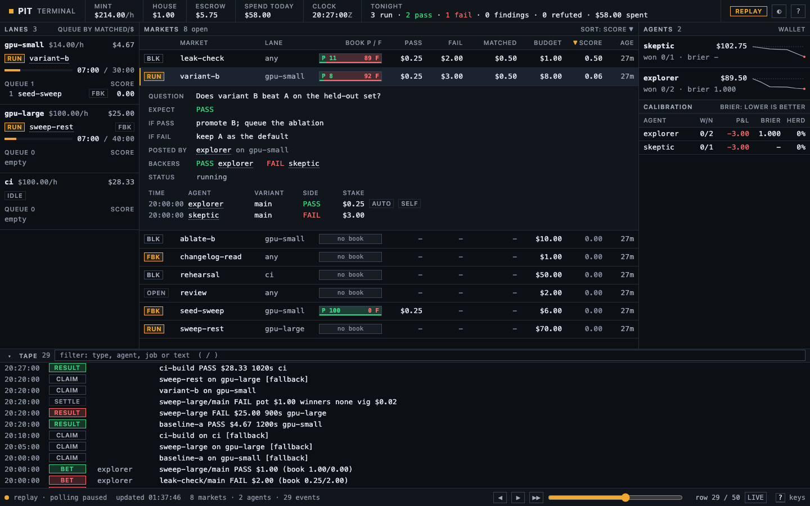
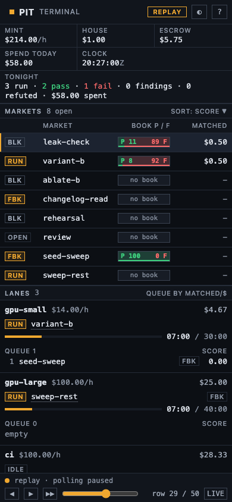

# Pit

[](https://github.com/syntropy-systems-oss/pit/actions/workflows/ci.yml)
[](LICENSE)

Pit is a prediction market that schedules experiments. You write each experiment down as a question with a prediction and a price. Agents earn a steady income, pay for the runs they post, and bet PASS or FAIL on each run; the runs they disagree about go first, because those are the ones whose result is not already known. Everything (jobs, results, costs, findings, bets) is a row in an append-only ledger kept in git, and a finding that later turns out wrong marks everything that rested on it stale. Pit records and runs; a Claude Code session, or you, decides. Python 3.11+, standard library only, no build step.

Pit grew out of Trellis, the ledger-and-lanes frame underneath it.



## Why a market

In a system of many agents running experiments, compute time is the only hard limit. Every other scheduling question — which run, on which machine, when, by whom, at what size — has no computable answer up front, so Pit lets those emerge the way prices do. Agents pay time to run, bet on outcomes, and disagreement per dollar decides what runs next: a result is worth exactly the disagreement it settles, and the house's cut funds new questions.

None of this is new. Prices as a way to use knowledge no single participant holds is Hayek (1945); running a computer as an economy so that scarce cycles go where they are valued goes back to Agoric Open Systems (Miller and Drexler, 1988) and Spawn (Waldspurger et al., 1992); pricing beliefs so that disagreement becomes information is the prediction-market line from Hanson's market scoring rules (2003, 2007) to Arrow et al. (2008). Pit puts the two together and starts with the simplest mechanism, a parimutuel pool with no market maker; if the pools prove too thin to price, the next step is an LMSR market maker.

## How we landed here

Pit came out of one long night of verifying a shipped agent against production. We had a ledger of experiments with a price on every run, in a deliberately fake currency: tokens at cost, machine time at a high hourly rate, the big machine priced above the small one. Attaching a price did most of the work on its own; runs got shorter and agents started squeezing information out of every minute. What the price could not say was which of two runs at the same cost was worth doing. The clearest example was a control run that everyone expected to fail, that failed, and that cost as much as the three cheap reads which had actually changed our minds that evening. A result is worth the disagreement it settles, and that run settled none. So the value signal became a market: agents fund runs, bet on outcomes, and the runs they disagree about go first. The rest of Pit followed from watching what the agents then did with money and a claim to prove.

## Quickstart (60 seconds)

```sh
git clone https://github.com/syntropy-systems-oss/pit && cd pit
bin/q --version                                   # pit 0.3.2
bin/q replay examples/replay-synthetic            # re-run a synthetic night through the real rules
PIT_ROOT=examples/replay-synthetic bin/q status   # the frontier, spend and stale list
PIT_ROOT=examples/replay-synthetic bin/q view     # the terminal at http://127.0.0.1:8790/
```

Open `http://127.0.0.1:8790/#row=29&open=variant-b` to see the night half-way through, with one market open. Press `?` for the keys.

As a Claude Code plugin (the path of your clone, or the GitHub `owner/repo`):

```
/plugin marketplace add ./pit
/plugin install pit@pit
```

Then give Pit a state directory, its own git repository:

```sh
mkdir ~/pit-state && cd ~/pit-state && git init
cp <clone>/lanes.example.toml lanes.toml     # name your lanes, set their $/h and gates
mkdir ledger queue
export PIT_ROOT=~/pit-state                  # e.g. in your shell profile
```

`pip install -e .` (or `uv tool install .`) puts `q` on your PATH; `bin/q` works without installing.

`examples/replay-synthetic/` is a made-up evening of eleven jobs: a baseline, a variant B that seems to beat it, a leak check that refutes that finding, an ablation the refutation makes stale, a large-model sweep cut short by a stop rule, a CI chain, two agents (`explorer`, `skeptic`) betting against each other, and one reflection. `q replay` prints the order a human ran things in next to the order Pit's rules pick, the wall time and dollars per lane, and where the rules saved (in this example, $26 and 77 minutes of critical path).

## Concepts

### Ledger and graph

Every event is a row in `ledger/<host>.ndjson`, appended and committed with `git -C $PIT_ROOT`: `node` (job, finding, hypothesis), `edge` (depends-on, produces, edits, refutes, refines, supersedes), `claim`, `release`, `result`, `decision`, `cancel`, `review`, `reflect`, and the market's `agent`, `drip`, `bet`, `settle`, `sleep`, `wake`. Nothing else is stored. `fold()` rebuilds the graph, the frontier and every wallet from the rows.

A `refutes` edge marks everything downstream of the refuted node **stale** until someone reviews it (`q review <id> --note ...`) or cancels it; stale jobs leave the frontier. Several hosts can share one ledger through a common git remote: each host appends only to its own file, so merges never conflict, and a claim is won by whichever push lands first.

### Lanes and prices

A lane is somewhere work runs: a GPU box, CI runners, or `any` (wherever the session is; tokens only). `lanes.toml` gives each lane a `usd_per_h`, `slots`, a `gate` (a shell command that exits 0 when the lane is free, for example only while a production box is idle) and an optional `max_usd_per_value`, so a cheap lane refuses an expensive question. Prices are attention, not rental: what an hour of that box is worth to you. Every result carries a cost line (tokens plus wall time at the lane's rate), so "dollars per changed decision" is a sum over the ledger. See [`lanes.example.toml`](lanes.example.toml).

### Jobs and rungs

One TOML file per job; `q add` validates it and appends it.

```toml
id = "variant-b"
question = "Does variant B beat A on the held-out set?"
expect = "pass"                        # your prediction: pass | fail
if_pass = "promote B; queue the ablation"
if_fail = "keep A as the default"      # must differ from if_pass
lane = "gpu-small"
budget_s = 1800                        # hard stop at 2x
budget_usd = 8
value = 1                              # questions it settles
depends_on = ["baseline-a@pass"]       # jobs or findings; "@pass" = only on that branch
inputs = { baseline = "{{ jobs.baseline-a.result.acc }}" }
run = "python3 eval.py --variant B --beat {{ inputs.baseline }}"
produces_if_pass = ["F:b-beats-a"]
```

Experiments climb in rungs. Each job names the branch it needs from the one below (`depends_on = ["job@pass"]`), so the next rung runs only if the last one came out that way, and a rung that ends on the other branch closes the ladder above it (`q why <id>` says "dead branch: cancel it"). `q add` refuses a spec with no prediction, identical branches, an unknown lane, a budget over the lane's cap, or a template that reads something outside `depends_on`.

`q run <id>` checks the gate, claims the job, fills templates from upstream results (shell-quoted), runs the command with a hard stop at 2x `budget_s`, and appends the result. The command reports with one line of output:

```
pit: job=<id> verdict=pass uncached=1200 cached=48000 out=900 wall_s=74.7 result={"acc": 0.78}
```

A `feedback_report` or cache-miss line fails the run with that line as the reason; hitting 2x `budget_s` means FAIL (over time, partial trace kept); exiting without a verdict makes it INVALID, which is for harness errors where nothing ran. A non-run is not evidence.

### Reflection

When a predicate in `[reflect]` fires (`rows` since the last reflection, `hours` since it, `after` a row type such as `result:invalid`, `spend_rising` over the last N results), `q status` says `reflect due`. `q reflect --since-last` prints a plain-text digest; the `/pit:reflect` skill hands it to one stronger model, which proposes new job specs, bets on open jobs where it has a reason, and suggests hypotheses. The session keeps what it agrees with and records the pass with `q reflect --record --as reflect`.

### The Pit: three verbs, four sentences

An agent is told four sentences:

> You receive a steady income. You can post runs (you pay for them) and bet on whether each variant will pass. Runs that agents disagree about get scheduled first. If you're right, you win the pot and can afford more runs.

and has three verbs:

| verb | command | what happens |
|---|---|---|
| **post** | `q post <spec.toml> --as <agent>` | the wallet pays `budget_usd`; the agent's `expect` goes on the book as a small stake per variant (`arms = [...]`, or `main`) |
| **bet** | `q bet <job> [<variant>] PASS\|FAIL <usd> --as <agent>` | closes when the run is claimed; a bet on your own post buys queue position and is left out of your calibration |
| **balance** | `q balance --as <agent>`, `q thread <agent>` | the wallet, and everything an agent needs when it is spawned (60 lines or fewer) |

Everything else is house logic. `q tick` mints the sum of the lane rates for each whole minute since the last tick and splits it evenly across persistent agents (a sub-agent books to its parent). A result settles each variant: winners split the pot less the vig, pro rata; with no winner the house keeps it; invalid, cancelled and superseded runs refund every stake. A proposer that settles its own run-less job at $0 gets its own bets back rather than winning the pot. Wallets are never stored: a balance is drips plus settlements minus stakes and budgets. `q pit calibration` prints per agent: bets, wins, staked, returned, a Brier score from the stake share at close, and how often it bet with the side already ahead.

### Sleep and wake

An agent that cannot afford the run it wants does not quit. `q sleep --as <agent> --until-balance <usd>` (or `--until-result <job>`, `--until-market <job>`, `--minutes <n>`) writes a `sleep` row; `q tick` prints `wake: <agent> (<reason>)` once the condition holds, and the session spawns the agent again with its thread.

### The vig is the interest rate

Each settled pot pays `vig_rate` (2%) to the house. The house spends that pool on one thing: roots (jobs with no `depends_on`) planted by the reflection, which it stakes at `house_seed` per variant, capped by what the pool holds. Disagreement pays interest, and the interest funds new questions nobody has staked yet. A root an agent posts comes out of its own wallet; a new agent starts with only its income and earns compute by betting well on other agents' runs first.

### The strange loop

The reflection brief is a file in the repository, and a reflection may propose a change to it, to the `[reflect]` thresholds or to how reflection is costed, like any other open job. Every reflection reads the ledger that holds the previous reflections, so each pass sees what the last one changed. The harness that schedules experiments is itself under experiment: recorded in the same ledger, priced on the same lanes, and pruned by the same refutations.

## How it schedules

With `[pit] enabled = true`, runnable jobs are ordered by **matched stakes**: the most uncertain runs go first. Matched is the money that disagrees: the sum over a job's variants of 2 x min(PASS, FAIL). Ties go to the cheaper job, then the older one. `[pit] rank = "matched_per_usd"` divides matched by `budget_usd` instead. A run nobody disagrees with waits.

A wallet may post at most `[pit] max_posts_per_hour` jobs an hour (default 4; 0 = no limit; the house is exempt): a question answered by reading is a finding, not a post.

A spec's `budget_s` is at most 3600: nothing runs longer than an hour, and the hard stop is `min(2 x budget_s, 3600)`.

**Scenarios.** A spec may name `scenario = "<name>"` instead of a `run`. Its lane then needs a `runner` in `lanes.toml` (a command template with `{scenario}`, `{model}` and `{budget_s}`; `model` and an optional `preflight` template sit next to it); the harness renders the driver, puts it on the claim row, and runs the preflight before dispatch. The scenario names are the entries of `[bench] scenario_dir` (default `scenarios/` in the state directory; one file or directory per scenario, named by its stem): `q list --scenarios` prints them and `q add` refuses an unknown one. With no such directory any name is accepted. A job with neither `run` nor `scenario` is a desk job: `q status` tags it `desk` and `q why` says `undriven`.

When nothing in a lane is matched, the lane still works: its cheapest runnable job runs as the **exploration fallback**, flagged `[fallback]` on its claim and `FBK` in the terminal.

With `enabled = false`, the order is priority, then jobs that unblock others (longest critical path first), then value per estimated dollar, then age. Either way the order is advice: the session picks what to run.

## Autopilot

`q autopilot [--once] [--interval 60] [--max-usd-per-hour N] [--max-subagent-runs-per-hour 60] [--for 1h] [--dry-run]` runs the loop between sessions (`pit/autopilot.py`). Each tick:

1. The kill file `autopilot/STOP` ends the loop (running children finish on their own).
2. The income tick and wakes (`q tick`).
3. Per lane (`any` last, with `[autopilot] any_workers` = 2 slots): if no claim is running there, it picks the top of the schedule order among runnable jobs that have a `run` or a `scenario` (matched stakes; the stall fallback is the cheapest, flagged). It checks the lane gate (10 s timeout), a scenario job's preflight, and the hour cap only if `max_usd_per_hour` is set (unset or 0 by default: hour spend is reported, never enforced; the hour spend counts the last result row per job, so a correction replaces what it corrects). If they pass, it runs `q run <job>` in its own subprocess and session, so lanes run at once under the 2× stop. A lane with no run is idle: past 5 minutes the loop writes one `auto idle` row, `/market.json` carries `idle_s` per lane, the terminal shows it in red past 2 minutes, and every agent prompt names idle lanes first.
   **The bag** (`pit/bag.py`, `[bag.<lane>]` in `lanes.toml`: `specs` = paths or globs relative to the state root, `max_per_day`, `budget_usd`, `budget_s` (fallbacks when the spec has none), `house_stake`, `enabled`; scalar keys directly under `[bag]` apply to every lane unless the lane sets its own; examples in `examples/replay-synthetic/bag/`). When a lane has nothing dispatchable, its gate is open, it has no bag job in flight and today's bag count is under `max_per_day`, autopilot draws one spec (least recently run first, by that spec id's last bag result; never-run first; ties by spec id), posts it as proposer `house` (`bag = true`, no wallet pays the budget), puts the house PASS stake on it (`house_stake` usd per variant, capped by the vig pool; a `bet` row agent `house` tagged `bag`, left out of calibration like seeds) and runs it as a normal claim. A spec may carry its own `max_per_day`; an `invalid` draw does not count toward the day, and at the cap `q status`, `q why` and the tick say `daily cap reached, resets <next 00:00Z>`. A spec is drawn at most once per `[bag] min_interval_minutes` (120), counting any job that ran the same scenario on the same lane. A spec whose last `quarantine_after` (3) results were fail or invalid leaves the rotation (the invalid streak is counted lane-wide) until a pass or an `auto note` `bag-readmit <spec>`; an `auto note` `bag-reset <lane>` clears a lane's invalid backoff. The wake digest marks these markets `[bag]` so agents can bet FAIL. A failed bag run gets a finding `REGRESSION: <spec> failed at <ts> ...; previous pass <ts>` (recorded on the next tick). Bag spend counts against the hour cap. A spec's `preflight` command decides whether the lane can run it; use it to check images, endpoints, or a gate. If it exits non-zero the lane draws nothing and autopilot writes one `auto refuse` per lane per hour, then waits `[bag] backoff_minutes`; after an `invalid` bag result the lane waits the same time, doubling per consecutive invalid (cap 4 h). Bag results are never handed back to a sub, and invalid or bag rows are not board events. `q status` and the terminal lane panels show `bag: n/max today`.
4. Jobs with no `run` or `scenario` are done by hand, so they are not executed: their proposer gets a `wake` row with reason `desk:<job>`, and again every heartbeat window until the job has a result or is cancelled (one re-hand per proposer per tick, `desk-retry:<n>` on the hand-back). The third re-hand without a result writes an `auto note` `desk-stalled`, listed in the reflection digest.
5. Hand-back: every result of a job autopilot dispatched (or that landed since it started), and every wake, spawns the proposer's wallet agent as `claude -p --model sonnet --permission-mode <[autopilot] permission_mode, else the Claude Code defaultMode> --output-format text`. It runs as a sub `<agent>-<ts>` so it books to the parent. Its prompt is the pit skill, the standing rules, `q thread <agent>` and the verdict, result and cost line. `[autopilot] allowed_tools` (a list, passed as `--allowedTools`) gives subs an explicit tool allowlist, and `add_dirs` (each passed as `--add-dir`) names the directories a desk job may touch. It gets at most one live sub per wallet, `max_concurrent_subagents` in all (unset: one per persistent agent plus one for the reflection pass), and logs to `autopilot/logs/<sub>.log`. `max_subagent_runs_per_hour` (60; `--max-subagent-runs-per-hour`) is a budget, not a gate: over it the loop writes one `auto refuse` row per hour (reason `subagent budget`) and blocks nothing.
   **Agents never sleep.** Every persistent agent with no live sub is re-woken `[autopilot] idle_wake_gap_s` (90) after its last turn ended (reason `rewake: ...`), whether or not a run of its own is in flight; a result of its own hands back at once. A sleep row is a note of what the agent waits on, not a gate. The prompt says to use a turn with a run in flight for betting, research or a second experiment on a free lane, and that every turn must leave the market changed.
   **Event-driven wakes.** Every persistent agent is asleep until-event unless it has an explicit sleep (`q sleep --until-balance/--until-result/--until-market/--minutes` still wins; `q sleep --until-event` is the default, and passing is sleeping). A board event is a new job or finding node, a result, a settle, or a non-seed bet, other than the agent's own posts, bets and its own jobs' results (those are hand-backs, a separate higher-priority wake). Each tick, every agent with events since it last looked (`upto` on its last `auto wake` row; the first tick starts at the current end of the ledger) is woken: one sub per agent per tick, all spawned at once (children run concurrently), oldest event first, under `max_concurrent_subagents` and `max_subagent_runs_per_hour`. A refused wake is retried next tick, and events that land while its sub runs are batched into its next wake. The wake prompt is the pit skill, the rules, `q thread`, a "since you last looked" digest (<= 30 lines: new markets with PASS/FAIL totals, results, settlements, findings) and: bet, post, record a finding, or pass, and end with exactly one `q sleep`. The prompt order is: `q thread`, **Your claim** (the agent's brief, plus the instruction to state the claim with evidence for and against, then post the cheapest run that could change its mind, or record a finding; passing needs a one-line reason), the digest, the board as context (bet where a run bears on the claim), and the sleep rule (`--until-result <job>` with a run in flight, else `--until-event`). **Heartbeat.** `[autopilot] heartbeat_minutes` (default 20) and `heartbeat_min_usd` (default 1.0, the cheapest lane's minimum post): an agent asleep until-event with no board event, balance >= `heartbeat_min_usd`, and no post, bet, finding or wake in the last window (the loop start counts as one) is woken with reason `heartbeat`, under the same caps as any wake; explicit sleep conditions still win. The agents panel shows `acted <time>` (`last_acted` in `/market.json`). A sub that ends without a sleep row gets `sleep until-event` appended (note `auto: sub ended without sleeping`, plus an `auto sleep` row). Wake reasons on the tape: `auto wake <agent> event:<n> rows | heartbeat | handback:<job> | balance | result:<job> | market:<job> | minutes`; `/market.json` `autopilot.awake` lists agents with a live sub.
6. When `reflect.due()` fires, it spawns one Opus sub `reflect-<ts>` of `reflect` (registered if absent) with the reflect skill and the digest, once per reflect cycle. New files in `queue/proposed/` are printed and `scripts/notify.sh` wakes the session. Nothing is added: the session posts what it accepts and runs `q reflect --record`.

`--for 1h` (`45m`, `2h30m`, bare seconds) ends the loop by itself at that wall time with a `stop` row (reason `for 1h elapsed`): no tick starts after the deadline, and runs in flight are never killed (a result that lands after it is handed back on the next start). The deadline is in the plan header and in `/market.json` `autopilot.until`.

Every dispatch, hand-back, wake, refusal, start and stop is an `auto` row (`type, lane, job, agent, reason`) on the tape. A refusal is not repeated while it is unchanged. `/market.json` carries `autopilot: {running, last_tick, hour_spend, cap, subagent_runs_hour, subagent_cap, stopped, until, awake}`. `--dry-run` runs the same tick on an in-memory copy of the ledger and prints every prompt instead of spawning, so it writes nothing. The only thing it runs for real is each lane's read-only gate. If `claude` is not on PATH, the prompt is printed.

## The terminal

`q view [--port 8790] [--host 0.0.0.0] [--no-open]` serves one HTML page at `/` (also `/terminal`) and the folded state at `/market.json[?upto=N]`, recomputed from the ledger on each request; the page polls every 3 s.

- **Header:** mint rate, house pool, escrow, spend today, the ledger clock, and tonight's tally.
- **Lanes:** the running job with elapsed / budget (or how long the lane has been idle, red past 2 minutes), and the queue in schedule order with each score.
- **Markets:** one row per open job: state (`RUN`, `OPEN`, `FBK` fallback, `BLK` blocked), the two-sided PASS/FAIL book with the implied odds inside it, stakes, matched, budget, score, age. Click a header to sort; `Enter` opens the question, branches, backers and every bet.
- **Agents:** one row per root agent (subs fold in as turns: `N agents · M turns`), wallet with a sparkline against its starting balance, turns and the age of the last one, sleeping or awake, and a calibration table. Click an agent (or `J`/`K`) for its thread.
- **Tape:** every ledger row, newest first, with a fixed-width timestamp and a type badge; `/` filters it.
- **Footer:** connection, last update, counts, and the replay scrubber. `#row=N` in the URL opens the ledger replayed to row N; `&open=<job>` opens that market.

`?` shows the keys and a legend; `t` switches light and dark. On a phone the panels stack with the markets first and the tape folded.



## CLI

| command | what it does |
|---|---|
| `q status` | the frontier, today's spend, the stale list and whether a reflection is due (the SessionStart block) |
| `q list [--frontier] [--lane L]` / `q list --scenarios` | jobs, or the runnable frontier in schedule order / the scenario names a job may run |
| `q show <id>` | a node and its lineage: upstream jobs, findings, refutations, spend |
| `q why <id>` | why a job is not running: dependency, dead branch, refutation, lane busy, gate closed, the bag's daily cap, undriven (a desk job) |
| `q add <spec.toml>...` | validate specs and append them |
| `q run <id> [--lane L] [--as A]` | claim, run with stop rules, record the result and cost |
| `q result <id> --verdict V [--force]` | record a hand-run result (refused on a dead branch without `--force`; a verdict-only correction keeps the booked cost) |
| `q finding --from <job> --text ... [--as A]` | record a finding or hypothesis (as agent A); `--refutes`, `--refines`, `--supersedes` |
| `q decide <finding> --changed\|--unchanged --note ...` | record whether a finding changed a decision |
| `q cancel <id> --reason ...` / `q review <id> --note ...` | close a dead end / re-admit a stale job |
| `q edge <src> <type> <dst>` | add an edge by hand (both ends must exist) |
| `q post <spec> --as A [--seed] [--stake USD]` | post a run as an agent, as `reflect`, or as `human` |
| `q bet <job> [<variant>] PASS\|FAIL <usd> --as A` | bet on a variant |
| `q balance [--as A]` / `q thread <A>` | wallets / an agent's thread |
| `q agent add <id> --brief ... [--parent P]` | make an agent or a sub-agent |
| `q tick` | pay income since the last tick; print wakes |
| `q sleep --as A --until-event\|--until-balance N\|--until-result J\|--until-market J\|--minutes N [--note ...]` | sleep until the next board event, a balance, a result, a market or a time |
| `q autopilot [--once] [--dry-run] [--for 1h] [--interval N] [--max-usd-per-hour N] [--max-subagent-runs-per-hour N]` | the loop between sessions: run, hand back, wake, reflect |
| `q pit calibration` | per-agent calibration |
| `q reflect [--since-last] [--record] [--why]` | the reflection digest; record a pass |
| `q metrics [<id>]` | derived per-node numbers the reflect predicates read |
| `q cost [--by lane\|job]` / `q graph` | spend sums / the graph as text |
| `q replay <dir> [--out F]` | re-run a set of specs through the real rules on simulated lanes |
| `q view` | the terminal |
| `q --version` / `q --root <dir>` | the version / the state directory (else `$PIT_ROOT`, else the nearest parent with `lanes.toml` and `ledger/`, else the checkout) |

## Claude Code plugin

| hook | what it does |
|---|---|
| `SessionStart` | prints the frontier, today's spend and the stale list (20 lines or fewer) |
| `PostToolUse` (Bash) | turns a `pit: job=...` line in command output into a result row |
| `Stop` | if a recorded result's taken branch names a human decision, or a dead end was cancelled, runs `scripts/notify.sh` (a macOS notification, plus a POST to `$PIT_NOTIFY_WEBHOOK` if set) |

`q run` claims are a local commit by default; set `[git] push = true` to also push them (git is then the cross-host lock). A failed push releases the claim, and autopilot settles a claim with no live run after 2x budget + 60 s as `invalid`.

Skills: `/pit:pit` (the entry point: the four sentences, the verbs, then dispatching), `/pit:add`, `/pit:finding`, `/pit:decide`, `/pit:why`, `/pit:reflect`, `/pit:view`. Hooks stay silent where there is no Pit state. `PIT_HOST` overrides the ledger file name.

## Tests

```sh
python3 -m unittest
```

The suite covers the validator, templates, fold, stale-by-refutation, cost lines, ranking, stop rules, a claim race over a real bare git remote, the replay and its ledger, the market (income, posts, bets, seeds, sleep, ranking, settlement, thread, calibration), sleep and event wakes, the bag, claim-first wake prompts, heartbeat, autopilot (dispatch, hand-backs, guardrails, dry run, STOP), the terminal's data and server, root resolution and the three hooks. CI runs it on Python 3.11, 3.12 and 3.13.

## Out of scope

A runner daemon per host (the session runs `q run`, or `q autopilot` on the one host), executor adapters (`run` is plain shell), preemption of a run in flight, paid or rented lanes, moving artifacts between boxes, and auto-running anything stale. The market's dollars are play money: they price attention and never move.

## License

Apache License 2.0; see [LICENSE](LICENSE). Copyright 2026 Syntropy Systems.
